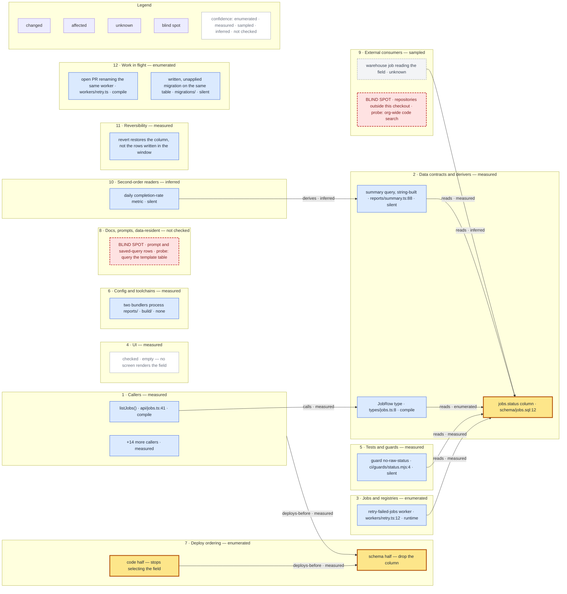

# A worked render

One envelope taken end to end. The change is a column drop — the `status` column on a `jobs`
table, with the value moving to a derived view. Names are illustrative; the shape is the point.

## The envelope, trimmed

Fields not needed to draw are elided. Nothing that *is* needed has been added.

```json
{
  "meta": {
    "baseRevision": "3f9c1ab", "headRevision": null, "dirty": false,
    "resolver": "name-based", "collisions": 184,
    "toolsUsed": ["git grep", "watskeburt 1.x"],
    "notScanned": ["the prompt-template store", "repositories outside this checkout"]
  },
  "surfaces": [
    { "id": "callers", "label": "Callers", "confidence": "measured" },
    { "id": "ui", "label": "UI", "confidence": "measured",
      "negatives": [{ "target": "any screen rendering the field", "query": "rg -n \"status\" app/",
                      "tool": "ripgrep", "control": "rg -n \"jobId\" app/", "control_fired": true,
                      "verdict": "absent" }] },
    { "id": "docs-and-data-resident", "label": "Docs, prompts, data-resident",
      "confidence": "not checked" }
  ],
  "nodes": [
    { "id": "n1", "label": "jobs.status column", "path": "schema/jobs.sql:12",
      "surface": "data-contracts", "state": "changed", "break": "none" },
    { "id": "n4", "label": "summary query (string-built)", "path": "reports/summary.ts:88",
      "surface": "data-contracts", "state": "affected", "break": "silent",
      "note": "returns rows with the field undefined; the report renders zero" }
  ],
  "edges": [
    { "from": "n4", "to": "n1", "kind": "reads", "confidence": "measured",
      "evidence": "rg -n \"SELECT .*status\" reports/ -> 1 hit @ 3f9c1ab" }
  ],
  "blindspots": [
    { "id": "b1", "label": "prompt and saved-query rows naming the field",
      "surface": "docs-and-data-resident",
      "reason": "no datastore was reachable from this run",
      "probe": "query the template table for rows containing the field name" }
  ]
}
```

## The diagram



## What to notice in it

- **All twelve surfaces are there**, in order, with their coverage word in the subgraph title.
  Surface 4 is empty and says which kind of empty it is: checked, with a control that fired.
  Surface 8 is empty of nodes and says `not checked`, and carries the blind spot that explains
  why.
- **Surface 12 is the one no checkout could have shown.** An open pull request renames the same
  worker and a written-but-unapplied migration touches the same table; neither exists in the
  tree the rest of the map was drawn against, and both meet this change in one tree later.
- **The two blind spots are nodes**, inside their own surfaces, each with its probe in the
  label. Neither is a caption. They are the first thing a reader's eye lands on, which is
  correct: they are the reason the rest of the picture is trustworthy.
- **`silent` is a label tag, not a colour.** Three nodes carry it — the string-built query, the
  guard that will pass forever once its pattern matches nothing, and the derived metric. Those
  three are the entire reason the map was drawn; a reader can find them by scanning.
- **One edge runs from a subgraph to a node.** `s_callers -->|deploys-before| n12` says every
  caller must stop reading before the column is dropped. That edge is why the diagram is a
  `flowchart` and not a `graph` — the older keyword cannot attach an edge to a subgraph.
- **One node has no edges at all.** `n10` records that two bundlers process the same directory;
  that is a property of a file, not a relationship between two nodes. Edgeless nodes are
  legitimate and the layout must keep them.
- **Evidence is not on the edge label.** Labels carry kind and confidence; the `evidence`
  string lives in the envelope and, in the interactive artefact, in the panel that opens when an
  edge is selected. Putting a `path:line @ sha` on every arrow makes the diagram unreadable and
  drops it below the node cap for the wrong reason.
- **Node states came from the envelope.** `n13` is `unknown` because nobody could establish
  whether the warehouse job breaks — it is not `affected` with a shrug attached.

## The metadata line

Directly under the diagram, in prose, every time:

> Rendered from the blast-area envelope `sha256:…` at base `3f9c1ab`, clean tree, no head
> revision. Resolver: **name-based**; 184 exported names in this repository are defined in more
> than one file, which is this map's precision ceiling. Tools: `git grep`, `watskeburt 1.x`; no
> module-graph tool was installed or present, so module-level import edges are **not checked**.
> Not scanned: the prompt-template store, repositories outside this checkout. Collapsed: 14
> caller nodes into one count node on surface 1. No comparison run.

## The blind-spot table

| id | Surface | What is unseen | Probe that would settle it |
|---|---|---|---|
| b1 | docs-and-data-resident | Prompt and saved-query rows naming the field | Query the template table for rows containing the field name |
| b2 | external-consumers | Repositories outside this checkout | Org-wide code search for the field name |

Two rows, and they are the part of this artefact most likely to be acted on. Both name a probe,
so each is a task someone can pick up rather than a shrug someone has to live with.
